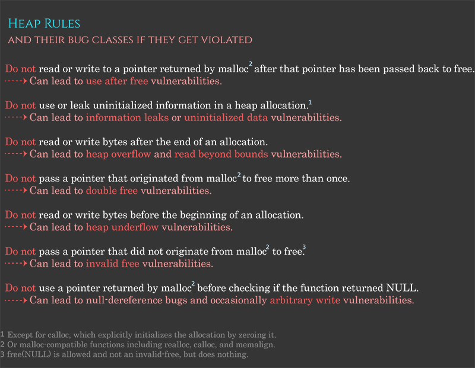

## Heap Based exploitation

### heap basics

1. google chrome --> PartionAlloc  heap allocatior
2. freeBSD --> jemalloc heap allocatior
3. glibc --> ptmalloc --> dlmalloc

### Why do people use heap ??
- Mannually allocate the new region during program execution. This is done via `malloc`.
- Then programmer can then interact with "allocations".
- After use it done, programmer can return the allocation back to heap manager using `free`. 

</img>
